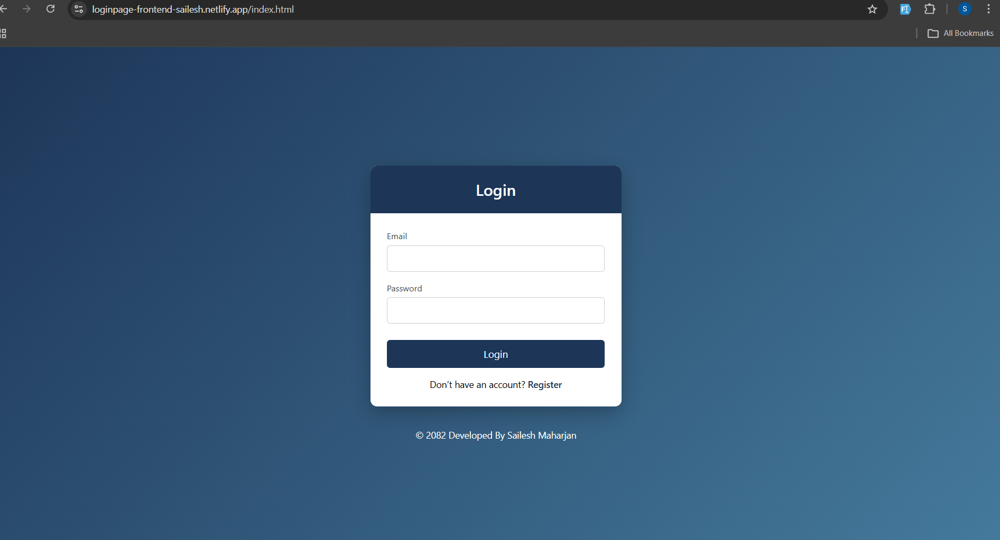
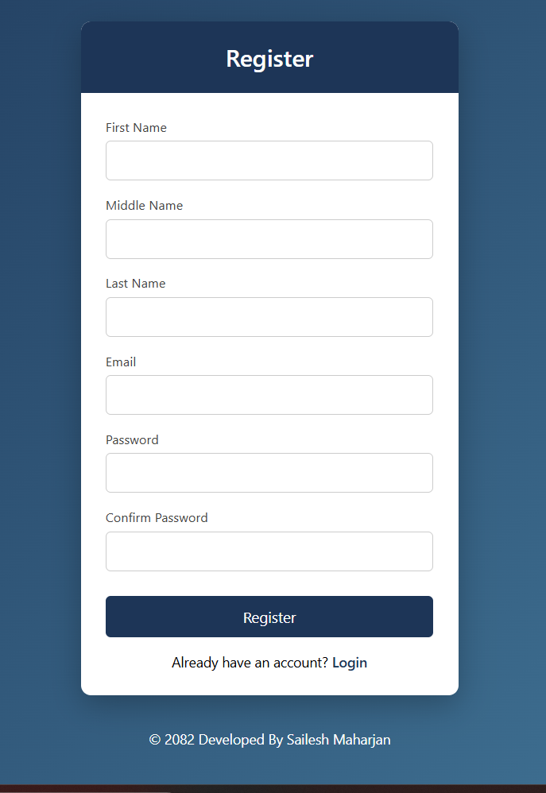
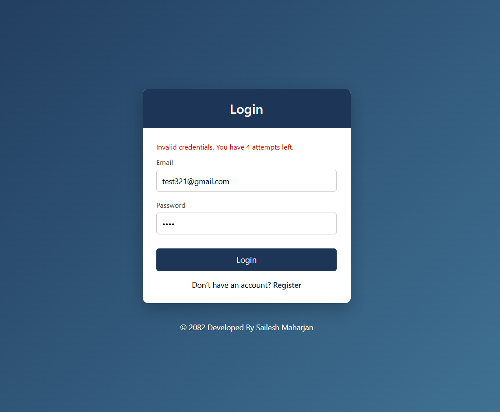
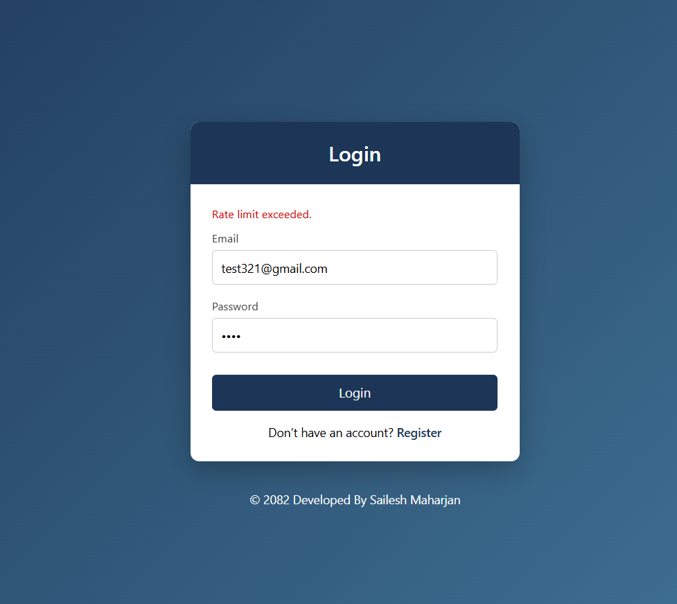
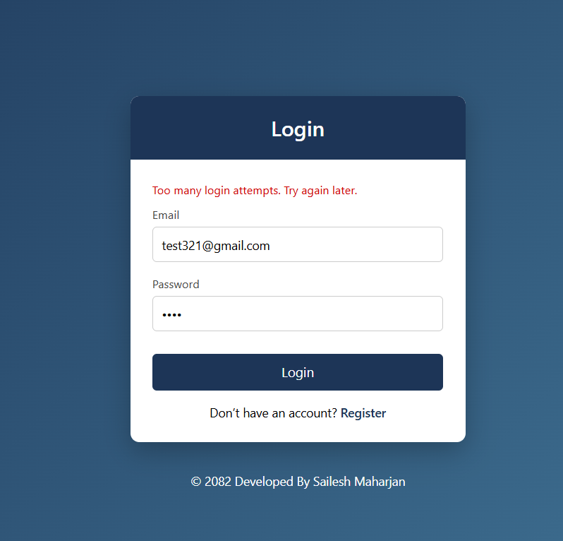
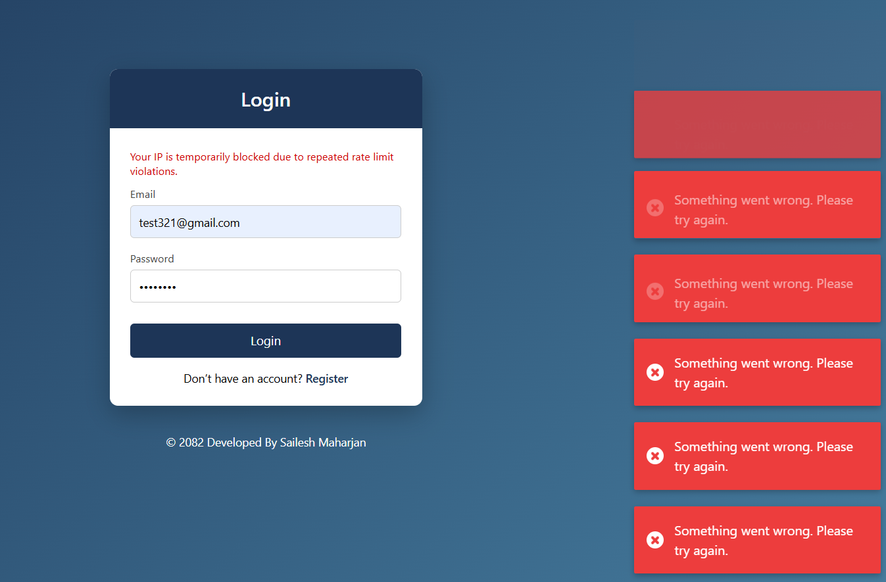
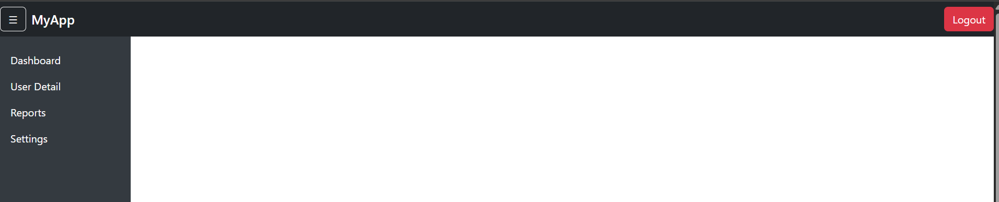
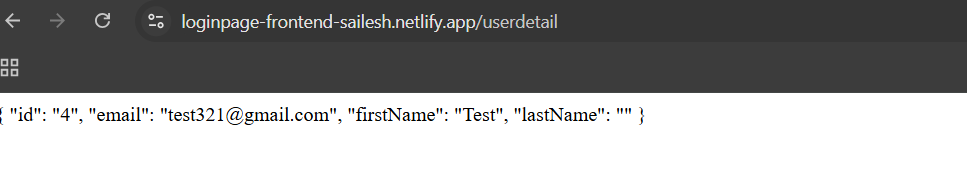

<h1 align="center" id="title">JWT Authentication Frontend (HTML CSS JavaScript)</h1>

A JWT Authentication Frontend is built using HTML, CSS, JavaScript, and Bootstrap 5 that integrates with a JWT_Authentication_Backend Web API . It implements secure authentication using a short-lived Access Token stored in localStorage and a rotating Refresh Token stored securely in an HttpOnly cookie. When the Access Token expires, a new one is automatically generated using the rotating Refresh Token. The application also supports protected API calls using a custom fetch wrapper, along with Login, Registration, and secure Logout with token revocation.

<h2>🚀 Demo</h2>

**Base URL :**  https://loginpage-frontend-sailesh.netlify.app

<h2>🧐 Features</h2>

Here're some of the project's best features:

*   This Login frontend provides user registration and secure login functionality with proper input validation.
*   When the Access Token expires, a new Access Token is automatically generated using a rotating Refresh Token.
*   All protected API calls are managed through a custom fetch wrapper that attaches the Authorization header
*   Users can securely log out, which revokes the Refresh Token and removes the Access Token from localStorage.
*  The interface features a responsive Bootstrap-based sidebar layout with notification alerts powered by Notyf toastr.

 <h2>💻 Built with</h2>

Technologies used in the project:

*   HTML5
*   CSS3
*   JavaScript (ES6)
*   Notyf (Toastr library)
*   Bootstrap 5
*   Netlify Platform (Deployment)

 <h2>Project Screenshots:</h2>

  ### Login
   
  
  ### Registration
  

  ###  Login Attempts
   

  ###  Rate Limit Exceeded
   

   

  ###  Temporary Blocked IP
   

  ###  After Login Success
   
   

<h2>🛡️ Further Improvement </h2>

* Instead of storing the access token in localStorage, it can be stored in an HttpOnly cookie so the browser automatically sends it with requests and prevents JavaScript access.
* Since cookies are vulnerable to CSRF attacks, the access token can alternatively be stored in JavaScript memory, requiring token re-generation after each page refresh for enhanced security.
* can implement role-based authorization (RBAC).

